# TodoApp

A simple Java todo application for practicing AI feedback loops. Practice building a harness that translates human intent to address technical debt into an automated feedback loop.



## What you should do

Guide an agent to:

1. Take the pain signal (warning)
2. Follow a guided intervention protocol (changes code)
3. Run grounding checks/feedback (build/test)
4. Produce an auditable change set (PR)
5. Repeat

## Constraints

- Small Steps: Fix one warning per PR
- Persistent Process: Process File / Skill
- Review: The Agent should review its own work
- Background: The Agent does not occupy your main workspace (It is not working on your development environment / your branch)

## Going Meta

A useful approach is to guide the AI step by step through fixing a single warning deliberately. Once successful, have the AI write this workflow into a markdown file so it can follow the same process autonomously for future warnings.

1. Pick one warning from the build output
2. Walk the AI through understanding the warning
3. Have it propose a fix
4. Verify the fix (build, test)
5. Ask the AI to document the workflow it just followed
6. Use that workflow for subsequent warnings

**Bonus:** Vibe code scripts that distill the feedback for the AI. Instead of dumping raw build output, create scripts that extract and format exactly what the AI needs to see - warning codes, file locations, relevant context - without bloating the context window.

## Out of Scope

Ideally, you prevent warnings from entering the codebase in the first place. Many warnings can also be auto-fixed by IDEs or tools. That's more efficient.

This exercise is not about that. It's about learning to work with AI agents: guiding them, giving them feedback, and letting them run in a loop on your desired workflow.

## Build

```bash
mvn clean compile
```

## Test

```bash
mvn test
```

## Dependency Analysis

Check for unused/undeclared dependencies:

```bash
mvn dependency:analyze
```

## Run

```bash
mvn exec:java -Dexec.mainClass="com.example.todo.App"
```

Or after packaging:

```bash
mvn package
java -jar target/todo-app-1.0.0.jar
```

## Warning Types

This project contains intentional warnings for practice:

### Compiler Warnings (-Xlint:all)

Run `mvn clean compile` to see:
- Raw types (using `List` instead of `List<TodoItem>`)
- Unchecked operations (adding to raw collections)
- Missing `serialVersionUID` on Serializable class
- Unused private fields and local variables
- Resource leaks (unclosed streams)
- Synchronization on non-final fields
- String comparison with `==` instead of `.equals()`

### Maven Dependency Warnings

Run `mvn dependency:analyze` to see:
- Unused declared dependencies (Guava, commons-io, commons-compress)
- Used undeclared dependencies (junit-jupiter-api)
